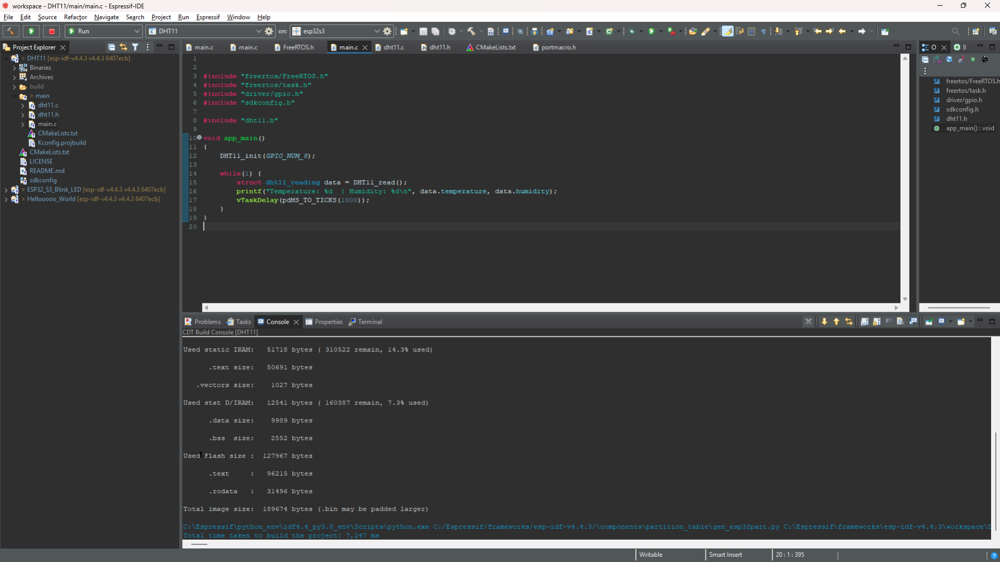
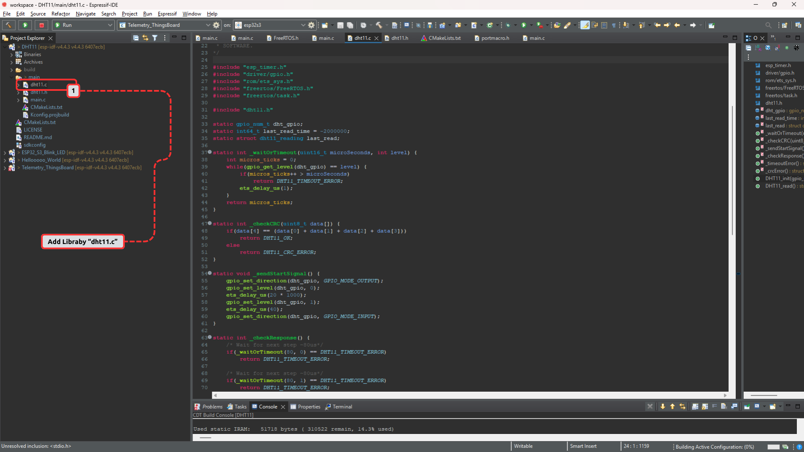
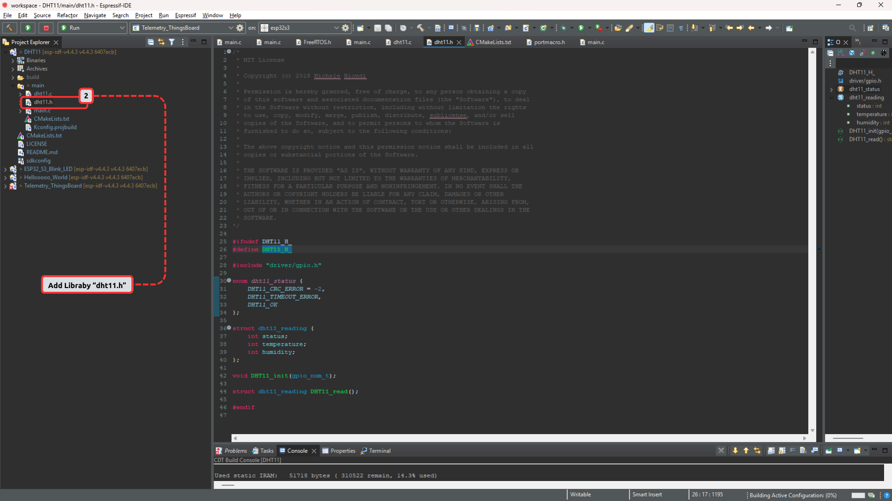
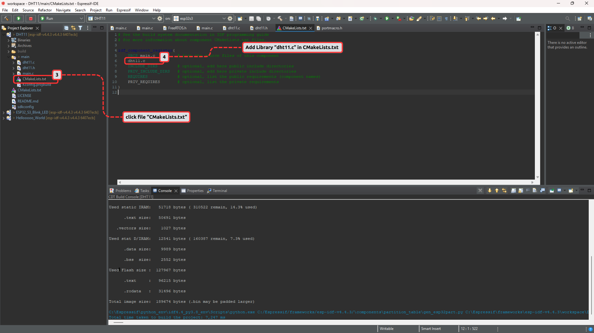
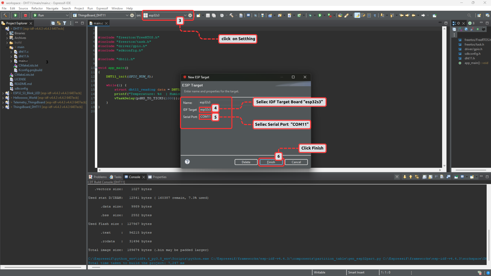
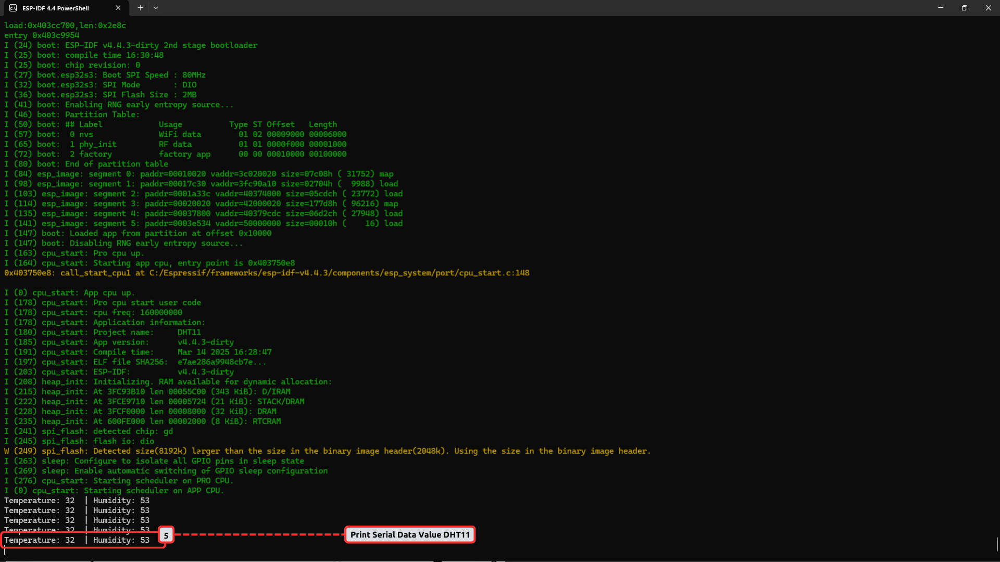

## RESUTL TESTING DHT11 

**1. main.c**




**2. dht11.c**

How to Add the **`dht11.c`** File:

* **Locate the Library:**
  * In your project structure, navigate to **`DHT11/main`** to find the **`dht11.c`** file.

* **Include the Library in Your Code:**
  * Open the source file (e.g., main.c) where you want to use the DHT11 functionalities.
  * At the top of your source file, add the following line:

```c
#include "dht11.h"  
```

* **Rebuild the Project:**

  * After including the library, save your changes.
  * Rebuild the entire project to ensure that the new library is linked correctly. This can usually be done by clicking on the **"Build"** or **"Run"** option in your IDE.



Following these steps will enable you to utilize the DHT11 sensor functions provided by the **`dht11.c`** library in your code.


**3. dht11.h**

How to Add the **`dht11.h`** File:

* **Locate the Library:**
  * Find the **`dht11.h`** file in the project explorer under the **`DHT11/main/dht11`** directory.

* **Include the Library in Your Code:**
  * Open the main source file (e.g., **`main.c`** or another relevant file).
  * At the top of your file, add the following line to include the DHT11 header:

```c
#include "dht11.h"  
```

* **Rebuild the Project:**

  * Save your changes after including the header.
  * Rebuild your project by selecting the **`"Build"`** option in your IDE to ensure the new library is linked properly.



By following these steps, you will enable the use of the DHT11 sensor functions provided in the **`dht11.h`** library within your project.

**4. CMakeLists.txt**

Adding **`dht11.c`** Library to the **`CMakeLists.txt`** for Project Configuration

* Steps to Add the **`dht11.c`** File:
  * **Locate the `CMakeLists.txt`:**
    * In the project explorer, navigate to **`DHT11/main`** and click on the **`CMakeLists.txt`** file.

  * **Modify the `CMakeLists.txt`:**
    * Open the **`CMakeLists.txt`** file for editing.
    * Find the section where you can specify components and libraries. Add the following line to include the **`dht11.c`** library:

```c
# See the build system documentation in IDF programming guide
# for more information about component CMakeLists.txt files.

idf_component_register(
    SRCS main.c         # list the source files of this component
    dht11.c
    INCLUDE_DIRS        # optional, add here public include directories
    PRIV_INCLUDE_DIRS   # optional, add here private include directories
    REQUIRES            # optional, list the public requirements (component names)
    PRIV_REQUIRES       # optional, list the private requirements
)
```

   * **Save the Changes:**
      * After adding the library reference, save the **`CMakeLists.txt`** file.
   * **Rebuild the Project:**
      * Click on the **`"Build"`** option in your IDE to rebuild your project. This will ensure **`dht11.c`** is linked correctly.
   


By following these steps, you will successfully add the **`dht11.c`** library to your project's configuration, enabling its functionalities in your code.

**5. Setting Up the ESP32 Target for Project Compilation and Upload:**

* **Steps to Add and Configure the ESP32 Target:**
  * **Access Project Settings:**
    * Click on the **Settings** option at the top of the IDE.
   
  * **Configure New ESP Target:**
    * In the pop-up window, set the **Name** to **`esp323`**.
    * Select the **IDF Target Board** as **`esp32s3`**.
   
  * **Select Serial Port:**
    * Choose the appropriate **Serial Port** (e.g., **`COM11`**) from the dropdown.
   
  * **Finish Configuration:**
    * Click **Finish** to save the new target configuration.
   
 

 Once completed, your project will be set up to compile and upload to the specified ESP32 board. This ensures that your code can communicate with the hardware correctly.

 **6. Running Code to Read Temperature and Humidity from DHT11 on ESP-IDF 4.4 PowerShell:**

 * **Open PowerShell:**
  * Launch PowerShell.**

 * **Navigate to Your Project Directory:**
  * Use the **`cd`** command to navigate to the directory where your ESP-IDF project is located.

 * **Run the Build, Flash, and Monitor Command:**
  * Execute the following command to build the project, flash it to the ESP32, and start monitoring the output:

```c
idf.py -p COM11 build flash monitor  
```

 * **View the Output:**
  * After running the command, you should see serial output reflecting temperature and humidity readings every few seconds, similar to:

```c
Temperature: 32  Humidity: 53   
```

 

 Following these steps will allow you to successfully compile and upload your code to the **ESP32**, enabling you to observe the **DHT11** sensor data in real-time.


  

  

